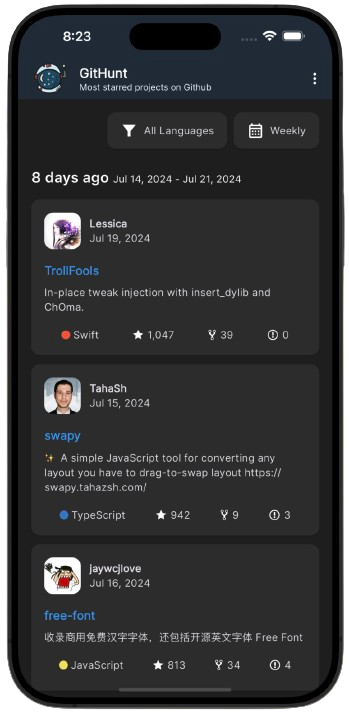

<h1 align="center">   GitHunt Flutter</h1>

  <b>Hunt the most starred projects on GitHub</b> 
  <b>Flutter version of <a href="https://github.com/kamranahmedse/githunt">GitHunt chrome extension</a></b>

## Description

A Flutter app implemented with <a href="https://pub.dev/packages/provider">Provider state management</a> that lets you explore trending repositories by filtering them by date range and programming language.

## Getting Started

1. Clone the repository: `git clone https://github.com/GnuaAruht/GitHunt_Flutter.git`
2. Navigate to the project directory: `cd GitHunt_Flutter`
3. Install dependencies: `flutter pub get`
4. Start the app: `flutter run`

## Credit

Credit to <a href="https://github.com/kamranahmedse/githunt">GitHunt</a> for resources and ideas.
